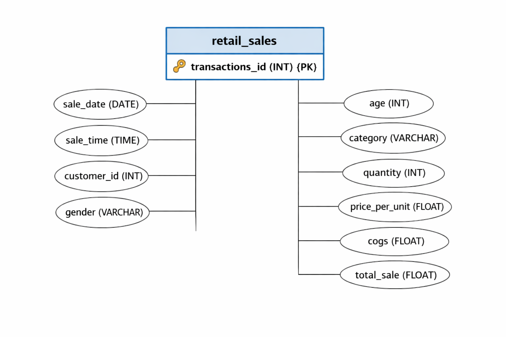

# **PostgreSQL_Retail Sales Analysis SQL Project**
pgAdmin4

## **Project Overview**

**Project Title**: Retail Sales Analysis  
**Database**: `p1_retail_db`

This project is designed to demonstrate SQL skills and techniques typically used by data analysts to explore, clean, and analyze retail sales data. The project involves setting up a retail sales database, performing exploratory data analysis (EDA), and answering specific business questions through SQL queries. This project is ideal for those who are starting their journey in data analysis and want to build a solid foundation in SQL.

## **Objectives**

1. **Set up a retail sales database**: Create and populate a retail sales database with the provided sales data.
2. **Data Cleaning**: Identify and remove any records with missing or null values.
3. **Exploratory Data Analysis (EDA)**: Perform basic exploratory data analysis to understand the dataset.
4. **Business Analysis**: Use SQL to answer specific business questions and derive insights from the sales data.

## **Project Structure**

## ER PostgreSQL_retail_sales_p1 Diagram


### **1. Database Setup**

- **Database Creation**: The project starts by creating a database named `p1_retail_db`.
- **Table Creation**: A table named `retail_sales` is created to store the sales data. The table structure includes columns for transaction ID, sale date, sale time, customer ID, gender, age, product category, quantity sold, price per unit, cost of goods sold (COGS), and total sale amount.

```sql
CREATE DATABASE p1_retail_db;

CREATE TABLE retail_sales
(
    transactions_id INT PRIMARY KEY,
    sale_date DATE,	
    sale_time TIME,
    customer_id INT,	
    gender VARCHAR(10),
    age INT,
    category VARCHAR(35),
    quantity INT,
    price_per_unit FLOAT,	
    cogs FLOAT,
    total_sale FLOAT
);
```

### 2. Data Exploration & Cleaning

- **Record Count**: Determine the total number of records in the dataset.
- **Customer Count**: Find out how many unique customers are in the dataset.
- **Category Count**: Identify all unique product categories in the dataset.
- **Null Value Check**: Check for any null values in the dataset and delete records with missing data.

```sql
SELECT COUNT(*) FROM retail_sales;
SELECT COUNT(DISTINCT customer_id) FROM retail_sales;
SELECT DISTINCT category FROM retail_sales;

SELECT * FROM retail_sales
WHERE 
    sale_date IS NULL OR sale_time IS NULL OR customer_id IS NULL OR 
    gender IS NULL OR age IS NULL OR category IS NULL OR 
    quantity IS NULL OR price_per_unit IS NULL OR cogs IS NULL;

DELETE FROM retail_sales
WHERE 
    sale_date IS NULL OR sale_time IS NULL OR customer_id IS NULL OR 
    gender IS NULL OR age IS NULL OR category IS NULL OR 
    quantity IS NULL OR price_per_unit IS NULL OR cogs IS NULL;
```

### 3. Data Analysis & Findings

The following SQL queries were developed to answer specific business questions:

1. **Write a SQL query to retrieve all columns for sales made on '2022-11-05**:
```sql
SELECT *
FROM retail_sales
WHERE sale_date = '2022-11-05';
```

2. **Write a SQL query to retrieve all transactions where the category is 'Clothing' and the quantity sold is more than 4 in the month of Nov-2022**:
```sql
SELECT 
  *
FROM retail_sales
WHERE 
    category = 'Clothing'
    AND 
    TO_CHAR(sale_date, 'YYYY-MM') = '2022-11'
    AND
    quantity >= 4
```

3. **Write a SQL query to calculate the total sales (total_sale) for each category.**:
```sql
SELECT 
    category,
    SUM(total_sale) as net_sale,
    COUNT(*) as total_orders
FROM retail_sales
GROUP BY 1
```
| **category** | **net_sale** | **total_order** |
|--------------|--------------|-----------------|
| Electronics  | 3114455      | 678             |
| Clothing     | 309995       | 698             |
| Beauty       | 286790       | 611             |
|--------------|--------------|-----------------| 

4. **Write a SQL query to find the average age of customers who purchased items from the 'Beauty' category.**:
```sql
SELECT
    ROUND(AVG(age), 2) as avg_age
FROM retail_sales
WHERE category = 'Beauty'
```

5. **Write a SQL query to find all transactions where the total_sale is greater than 1000.**:
```sql
SELECT * FROM retail_sales
WHERE total_sale > 1000
```

6. **Write a SQL query to find the total number of transactions (transaction_id) made by each gender in each category.**:
```sql
SELECT 
    category,
    gender,
    COUNT(*) as total_trans
FROM retail_sales
GROUP 
    BY 
    category,
    gender
ORDER BY 1
```
| **category** | **gender** | **total_trans** |
|--------------|--------------|-----------------|
| Beauty       | Female       | 330             |
| Beauty       | Male         | 281             |
| Clothing     | Female       | 347             |
| Clothing     | Male         | 351             |
| Electronics  | Male         | 343             |
| Electronics  | Female       | 335             |
|--------------|--------------|-----------------| 

7. **Write a SQL query to calculate the average sale for each month. Find out best selling month in each year**:
```sql
SELECT 
       year,
       month,
    avg_sale
FROM 
(    
SELECT 
    EXTRACT(YEAR FROM sale_date) as year,
    EXTRACT(MONTH FROM sale_date) as month,
    AVG(total_sale) as avg_sale,
    RANK() OVER(PARTITION BY EXTRACT(YEAR FROM sale_date) ORDER BY AVG(total_sale) DESC) as rank
FROM retail_sales
GROUP BY 1, 2
) as t1
WHERE rank = 1
```
| **year** | **month** | **avg_sale**      | 
|----------|-----------|-------------------|
| 2022     | 7         | 541.3414634146342 |     
| 2023     | 2         | 535.531914893617  |    
|----------|-----------|-------------------| 

8. **Write a SQL query to find the top 5 customers based on the highest total sales **:
```sql
SELECT 
    customer_id,
    SUM(total_sale) as total_sales
FROM retail_sales
GROUP BY 1
ORDER BY 2 DESC
LIMIT 5
```
| **customer_id** | **avg_sale**      | 
|-----------------|-------------------|
| 3               | 3840              |  
| 1               | 30750             |     
| 5               | 30405             |     
| 2               | 25295             |        
| 4               | 23580             |    
|-----------------|-------------------|

9. **Write a SQL query to find the number of unique customers who purchased items from each category.**:
```sql
SELECT 
    category,    
    COUNT(DISTINCT customer_id) as cnt_unique_cs
FROM retail_sales
GROUP BY category
```
| **category** | **cnt_unique_cs** | 
|--------------|-------------------|
| Beauty       | 141               |  
| Clothing     | 149               |        
| Electronic   | 144               |        
|--------------|-------------------|

10. **Write a SQL query to create each shift and number of orders (Example Morning <12, Afternoon Between 12 & 17, Evening >17)**:
```sql
WITH hourly_sale
AS
(
SELECT *,
    CASE
        WHEN EXTRACT(HOUR FROM sale_time) < 12 THEN 'Morning'
        WHEN EXTRACT(HOUR FROM sale_time) BETWEEN 12 AND 17 THEN 'Afternoon'
        ELSE 'Evening'
    END as shift
FROM retail_sales
)
SELECT 
    shift,
    COUNT(*) as total_orders    
FROM hourly_sale
GROUP BY shift
```
| **shift** | **total_order** | 
|-----------|-----------------|
| Morning   |  548            |  
| Afternoon |  377            |        
| Evening   | 1062            |        
|-----------|-----------------|

**"Insight:** Evening shifts show _the highest order_ volume, suggesting a need for more staffing during those hours."

## **Findings**

- **Customer Demographics**: The dataset includes customers from various age groups, with sales distributed across different categories such as Clothing and Beauty.
- **High-Value Transactions**: Several transactions had a total sale amount greater than 1000, indicating premium purchases.
- **Sales Trends**: Monthly analysis shows variations in sales, helping identify peak seasons.
- **Customer Insights**: The analysis identifies the top-spending customers and the most popular product categories.

## **Reports**

- **Sales Summary**: A detailed report summarizing total sales, customer demographics, and category performance.
- **Trend Analysis**: Insights into sales trends across different months and shifts.
- **Customer Insights**: Reports on top customers and unique customer counts per category.

## **Business impact —**
- "Cleaned dataset to ensure accuracy"
- "Analyzed customer demographics and identified top-spending customers"
- "Discovered peak sales months and high-value transactions"

## **Key Technical Skills Demonstrated:**
- **Advanced Window Functions:** Used **RANK()** for top-selling month analysis.
- **Complex CTEs:** Utilized Common Table Expressions for _time-shift classification_.
- **Data Aggregation:** Proficient in **GROUP BY, HAVING,** and **Multi-level sorting**.

## **Conclusion**

This project serves as a comprehensive introduction to SQL for data analysts, covering database setup, data cleaning, exploratory data analysis, and business-driven SQL queries. The findings from this project can help drive business decisions by understanding sales patterns, customer behavior, and product performance.

## **How to Use**

1. **Clone the Repository**: Clone this project repository from GitHub.
2. **Set Up the Notebooks**: Run the shopping-behavior dataset provided in the `data` folder to create and populate the analysis.
3. **Run the Syntax**: Use the Python syntax provided in the `Import the retail_sales.csv to PostgreSQL" and "Execute the SQL queries in pgAdmin4 or psq` file to perform your analysis.
4. **Explore and Modify**: Feel free to modify the syntax to explore different aspects of the dataset or answer additional business questions.

## **Author - Kyawsanoo5**

This project is part of my portfolio, showcasing the SQL skills essential for data analyst roles. If you have any questions, feedback, or would like to collaborate, feel free to get in touch!

### **Stay Updated and Join the Community**

I'll be practise more project on SQL, data analysis, data science and other data-related topics.

- **LinkedIn**: [Connect with me professionally](www.linkedin.com/in/kyaw-sanoo-425009396)
